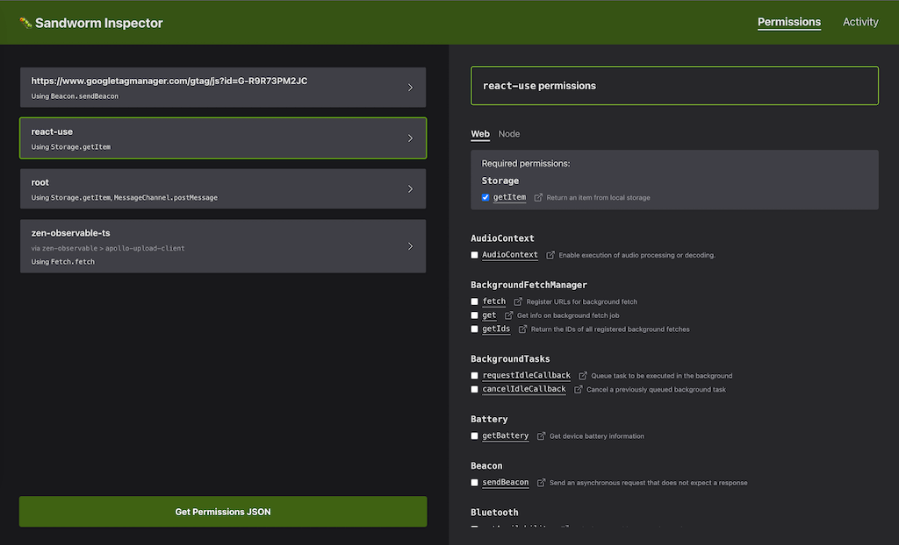

# Sandworm Test Framework Plugins

Easily extract your application permissions from your automated test suite. Snapshot-test your security to keep track of potential vulnerabilities.

Plugins currently available for [Mocha](https://github.com/sandworm-hq/sandworm-mocha) and [Jest](https://github.com/sandworm-hq/sandworm-jest).

## Why
* This will give you an out-of-the-box security profile for both your app and your dependencies, based on the dynamic analysis of code executed by your test runner.
* Simple obfuscation techniques can confuse static analysis tools, but Sandworm will always intercept risky calls at run time.
* The generated security profile will help everyone working with your code to better understand the inner workings of your app and dependencies, and be aware of potential vulnerabilities.
* The security profile will act as a snapshot that each test suite run will match against. This will raise the alarm if you add or remove code or dependencies that do sensitive things and signal that an audit is due.
* Use the Inspector for under-the-hood auditing and debugging of your code.
* If you choose to, it's easy to start enforcing permissions in production mode using Sandworm.

## Setting Up

### Use with Jest

> Plugin repo: [https://github.com/sandworm-hq/sandworm-jest](https://github.com/sandworm-hq/sandworm-jest)

Install the plugin:

```bash
npm install --save-dev sandworm-jest # or yarn add --dev sandworm-jest
```

Then update your Jest config file to include the plugin modules:

```javascript
module.exports = {
  // ... your Jest configs
  globalSetup: require.resolve('sandworm-jest/setup'),
  globalTeardown: require.resolve('sandworm-jest/teardown'),
  setupFilesAfterEnv: [require.resolve('sandworm-jest/setupFiles')],
}
```

If you're already using `globalSetup` or `globalTeardown`, you can manually call the corresponding Sandworm method:

```javascript
// in your config file
module.exports = {
  globalSetup: require.resolve('./test/setup.js'),
}

// in ./test/setup.js
const sandwormSetup = require('sandworm-jest/setup');

module.exports = async () => {
  await sandwormSetup();
  // The rest of your setup logic
};
```


### Jest Code Transformations

Note that if you use some syntax not supported by Node out of the box, Jest will default to using `babel-jest` to transform that code into plain JavaScript, similar to what you would do when building for browsers. This means the permissions Sandworm captures will represent the transformed code and not your source directly.

Hence, you might see Babel artifacts in your permissions file, such as the use of `new Function('return this')` to access the `global` object.

### Use with Mocha

> Plugin repo: [https://github.com/sandworm-hq/sandworm-mocha](https://github.com/sandworm-hq/sandworm-mocha)

Install the plugin:

```bash
npm install --save-dev sandworm-mocha # or yarn add --dev sandworm-mocha
```

Then add `--require sandworm-mocha` to your mocha command arguments. This will load Sandworm and set up recording events before your tests start.

## Exclude Testing Code

Next, you'll probably want to exclude calls made by your test code from the output, since you only want to capture your core app's security profile. To do this, create a `.sandworm.config.json` file in your app's root, containing one or more of the following attributes:

* `aliases`
  * Use this to give an alias to some of your root code, based on the file path

* `ignoredModules`
  * Use this to exclude specific modules from the output

> **Note**
> Read more about aliases in [Sandworm's docs](https://docs.sandworm.dev/#aliases).

> **Note**
> Dev dependencies are always excluded from the output.

For example, to exclude test code and fixtures from [Express](https://github.com/expressjs/express), you could use the following configuration:

```json
{
  "aliases": [
    {"path": "express/test", "name": "test"},
    {"path": "express/examples", "name": "test"}
  ],
  "ignoredModules": ["test"]
}
```

## Generate The Package Permissions File

You're now ready for the initial run, that will output the `package-permissions.json` security snapshot in your app's root. When running your test suite, you should now see Sandworm booting up in the console logs:

```
[🪱 Sandworm]: Setting up intercepts...
[🪱 Sandworm]: Intercepts ready
```

After the tests end, you should see Sandworm reporting on the number of events it has captured:

```
[🪱 Sandworm]: Intercepted 2672 events
```

You should now also see a new `package-permissions.json` file in your app's root directory, containing an array of permission descriptor objects that each have the following attributes:

* `module` - the module or caller path name responsible for invoking sensitive methods
* `permissions` - an array of strings representing each invoked method, e.g., `fs.readFile`.

Here's an example of what the file might look like:

```json
[
  {
    "module": "root",
    "permissions": [
      "Function.Function",
      "fs.readFile"
    ]
  },
  {
    "module": "source-map-js",
    "permissions": [
      "Function.Function"
    ]
  }
]
```

## Audit & Update On Changes

At this point, you should take your time to audit this file, and make sure each permission makes sense and represents an operation that's critical to your app's functionality. Once that's done, commit it to your repository. This will become the snapshot that future test suite runs match against.

Whenever adding or removing code or dependencies that use sensitive methods, you'll need to manually update this file to reflect the changes (or remove it and run the test suite again to have it automatically regenerated).

## Use The Inspector To Deep Audit & Debug

The Inspector is a browser app that gives an in-depth view into all of the calls intercepted by Sandworm. To launch it, run this before executing your test suite:

```bash
npm run sandworm # or yarn sandworm
```

The Inspector UI should now be available at [http://localhost:7071](http://localhost:7071). In the left, you'll see a list of all caller paths that have been intercepted. The Permissions tab displays an aggregated list of all required permissions, while the Activity tab hosts a list of all intercepted calls. For each method call, you can see the associated arguments as well as a stack trace that can help you figure out exactly who called what.

> **Note**
> You'll also see dev dependency activity in the Inspector.


